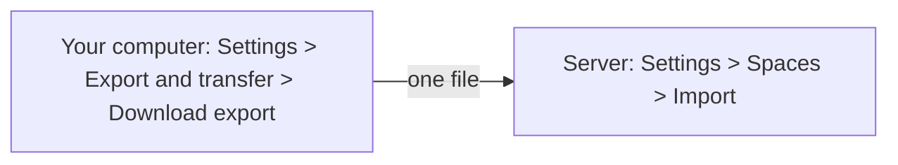

Sometimes a space has to move: you built a website on your own computer and now want it on the real server, or you want to hand a finished space to a colleague who runs their own Manablox. For that, Manablox packs a space into one file (an **export**) and unpacks it on the other installation (an **import**).

A typical journey looks like this:

:::note
An export moves one space between two separate installations. It is not a backup of the whole installation, with all its users and spaces. For that, see [Backups](../going-live/backups.md).
:::

## Who can do it

- **Exporting** needs the permission to export a space. Owners and admins of the space have it. Without it, **Export and transfer** does not appear in the settings.
- **Importing** needs a superadmin on the target installation (the first account created there is one), because an import creates a new space.

## What travels, and what does not

By default an export is a full copy of the space. You can leave parts out if you like (see below). The space's own settings (its name, languages and so on) always travel.

| Part | What it carries |
| --- | --- |
| **Documents** | Every document in every language, drafts and published ones, with their dates and publishing schedule. |
| **Document history** | Every saved version, so you can still roll back on the new installation. Makes the file much larger. |
| **Asset records** | The names, alt texts and details of your images and files, but not the files themselves. |
| **Asset files** | The actual image and file contents. Choosing these turns the export into a zip archive. |
| **Content types** | The types built in the admin. Types a developer defined in the project's code come from the target installation's own code. |
| **Menus** | Navigation menus and their entries. |
| **Roles** | Custom roles and their permissions. |
| **Redirects** | Automatic and manual [redirects](./redirects.md) of old addresses. |
| **Workflows** | The workflows themselves, not their past runs. Only with the workflows plugin |
| **Webhooks** | The webhooks and their settings, not their logs. Only with the webhooks plugin |
| **Credentials** | The names and kinds of stored passwords and keys, but empty. See below. |
| **AI providers** | Models, house style and defaults, but not the API keys. |
| **Site designs** | For a [designed site](../design/index.md): the theme, the designs of blocks, pages, layouts and menus, and the site settings, drafts and published ones. Not their older versions. |
| **Domains** | The web addresses of the designed site. Not ticked on import unless you tick it, because one address can only belong to one space per installation. |

Some things never travel:

- **Members and accounts.** Each installation has its own people. Whoever imports the space becomes its owner; add the others again afterwards (see [Spaces and members](./spaces.md)).
- **Secrets.** Passwords, keys and AI keys are locked with a secret that belongs to the old installation, so they could not be opened on the new one anyway. Credentials arrive as empty shells, AI providers arrive switched off, and webhooks that need a secret arrive switched off.
- **API keys, the activity log, notifications, approval requests, workflow runs and webhook logs.** These belong to the installation they were made on.

## Step 1: export the space

1. On the old installation, pick the space in the space switcher at the top of the sidebar, if you are not working in it already.
2. Click **Settings** in the sidebar.
3. Click **Export and transfer** in the side panel, under **This space**. You only see it if you may export the space.
4. The card **Download a copy of this space** is open. A tip above it reminds you how to import the file later.
5. In step 1, **Pick the file type**, leave **Zip archive** (the default). It includes the uploaded images and files themselves. **JSON file** is smaller, but without the uploaded files: only their names and details travel.
6. In step 2, **Choose what to include**, leave "A full copy of the space." to take everything. To take only some parts, see below.
7. In step 3, **Download**, click **Download export**.

Your browser downloads a file named after the space and the date, for example `website-2026-09-11.manablox.zip` (or `.json`). Keep it somewhere safe; it contains all your content.

### Taking only part of a space

You do not have to move everything. In step 2, **Choose what to include**, click **Leave some parts out**. A list of all parts appears, in the groups **Content**, **Model and structure**, **Designed site** and **Integrations**. Each group has an **All**/**None** button, and the number at the end of each row shows how many of that thing the space has. Untick what should stay behind. **Back to a full copy** ticks everything again.

Next to a ticked row, a small arrow lets you narrow it down:

- For content types, menus, roles and credentials, you pick single entries by name.
- For **Documents**, you pick by **Content types**, **Locales** (languages) and **Status**.

A document whose parent page is left out is left out too, because its web address depends on the parent.

:::caution
A **JSON file** export does not contain your images and files, only their descriptions. If you import it elsewhere, documents point at pictures that are not there. Choose **Zip archive** unless a developer copies the files for you separately.
:::

## Step 2: prepare the new installation

Check two things on the target installation before importing:

- **The space must not exist there yet.** An import restores a space under its original identity; it does not make a copy. If the target already has this space (or one with the same technical name), the import is refused.
- **Content types from code must be there.** If some of your content types were defined by a developer in the project's files rather than built in the admin, the target project needs the same definitions. Otherwise the import stops with a message that a content type is missing. See [Content types in code](../your-project/content-types-in-code.md).

## Step 3: import the space

1. Sign in to the new installation as a superadmin.
2. Click **Settings** in the sidebar, then **Spaces** in the side panel.
3. Click **Import** at the top right, next to **New space**.
4. Under **Export file**, choose the file you exported.
5. The window shows the space's name and whether the file is an archive or JSON. Under **Restore**, untick anything you do not want, just like on the export side.
6. Click **Import space**.

The new space appears in the list right away, marked **importing**. Click it to switch to it; its **General** settings show a progress bar and the step it is on, for example "Documents, batch 3". Its pages open once the import has finished; until then it takes no edits (saving answers "This space is still importing"), and the website and workflows do not see it: the public API answers 404 for it. You are its owner.

### If the import stops partway

A large import runs in many small steps, and each finished step stays saved. If something goes wrong partway (the server restarts, the disk is full), the space stays in the list marked **failed**, with the error. Click it under **Settings > Spaces**; its **General** settings offer:

- **Resume import** continues where it stopped. The installation kept a copy of your file, so you do not upload it again. Only a superadmin sees this button.
- **Delete space** removes the space and everything imported so far, after asking. You can then import the file again.

An import that shows no progress for ten minutes, for example because the server restarted in the middle, is treated as interrupted: the section says "No progress for a while" and offers **Resume import** too. If the installation could not keep a copy of the file, the section says so, and only **Delete space** is left.

## Step 4: after the import

Go through this short checklist on the new installation:

1. **Open a few pages** in **Content** and check texts and images. Published pages are published again automatically, keeping their original publishing dates.
2. **Fill in credentials.** Under **Settings > Credentials**, open each credential and enter its secret again.
3. **Switch webhooks back on.** Under **Webhooks**, check each webhook, pick its credential if needed, and switch it on (see [Webhooks](./webhooks.md)).
4. **Enter AI keys.** Under **Settings > AI**, add the API keys and switch the providers on (see [AI](./ai.md)).
5. **Check workflows.** Under **Workflows**, look at each one before relying on it. Workflows keep the on/off state they had, so a workflow that sends mail may already be switched on.
6. **Invite people.** Add the members again under **Settings > Members** and give them their roles.
7. **Update your website.** If a website shows this space, it now has to talk to the new installation. That is a job for the developer; the space's identity is unchanged, so usually only the address of the CMS changes.

## Export as code

Below the download card, **Settings > Export and transfer** has a second card, **Export as code**, marked **Advanced**. Click its row to open it. It is meant for developers: it turns content types, workflows, webhooks, credentials and templates you built in the admin into code for the project's config files, so they can be kept and reviewed together with the website's code. Tick what you want and click **Download config**. Hand the downloaded file to your developer; see [Workflows and webhooks in code](../your-project/resources-in-code.md) and [Content types in code](../your-project/content-types-in-code.md).
