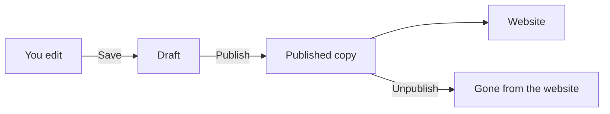

You never edit the live website directly. You edit a **draft**, save it as often as you like, and only when it is ready do you **publish** it. This page explains what each button does, what the website sees in the meantime, and how to undo a mistake with the version history.

## Two copies of every document

A document of a publishable type exists in two copies:

- the **draft**, which you edit in the admin,
- the **published copy**, which the website shows.

Saving changes only the draft. The website keeps showing the published copy until someone publishes again. So you can rework a live page over several days without visitors seeing half-finished text.

## What the buttons do

The buttons are in the header of the document editor, see [Editing content](../admin/editing-content.md).

| Button | What happens | What the website sees |
| --- | --- | --- |
| **Save** | Stores the draft and records a new version | No change |
| **Publish** | Copies the draft to the published copy. If there are unsaved changes, it saves them first. Refused if another document already has the value of a **Unique** field live | The new content |
| **Unpublish** | Removes the published copy. The draft stays | The page is gone, and so is every page below it in the tree |
| **Delete** (the trash button) | Removes the document, its published copy and every document below it in the tree. It cannot be undone | Everything is gone |

**Publish** is only active when there is something new to publish: the document was never published, or it was changed since. **Unpublish** is only active when the document is published.

:::caution
Unpublishing a page takes all pages below it off the website too, because a page cannot be reachable under a parent that is not there. Each of those pages goes back to **draft** as well: its green dot in the tree disappears, and a planned **Unpublish at** date is cleared. Their drafts stay. To bring them back, publish the parent again and then each page below it.
:::

Only people whose role allows publishing see **Publish**, **Unpublish** and **Schedule**. An **Author**, for example, can write and save but not publish. For types that need approval, authors ask for approval instead; see [Notifications and approvals](../admin/notifications.md).

## The status badge

Next to the document's title in the editor, a badge tells you the state the document would be in if you closed the tab now:

| Badge | Meaning |
| --- | --- |
| **new** | Not saved yet at all |
| **unsaved** | You changed something and have not saved it |
| **draft** | Saved, but never published (or unpublished again). The website does not show it |
| **live** | Published, and the website shows exactly what you see |
| **changed** | Published, but saved again since. The website still shows the older published copy. Publish to update it |
| **scheduled** | A publish or unpublish date is set (shown in addition to the others) |

In the content tree, a small green dot next to a title means the document is published.

## Types without publishing

When a document type has **Publishable** switched off (see [How content is organised](./index.md#content-types)), its documents have only one copy and no **Publish** button. They are never published, so the website's public API never shows them. Use such types only for content the admin itself needs, not for anything visitors should see.

## Planning a publication

You can set a date and time at which a document goes live, comes down again, or both. This is handy for a campaign page that should appear on Monday morning and disappear after the weekend.

1. Open the document and save it at least once.
2. Click **Schedule** in the editor's header.
3. Fill in **Publish at** (goes live at this time), **Unpublish at** (comes down at this time), or both.
4. Click **Save schedule**.

You should see the message "Schedule saved", and the **scheduled** badge appears next to the title. Hover over the badge to see the dates.

Good to know:

- The dates are checked every few seconds, so a document goes live within about half a minute of the time you set.
- A scheduled publish publishes the draft as it is at that moment, exactly like clicking **Publish**. Keep saving your changes until then.
- **Unpublish at** must be later than **Publish at**, or the schedule is refused.
- Publishing by hand clears **Publish at** and keeps **Unpublish at**. Unpublishing by hand clears **Unpublish at**.
- **Clear** in the Schedule panel removes both dates.

## Versions

Every save keeps a snapshot of the whole document: title, slug, place in the tree and every field. You can go back to any of them.

1. Open the document and click **History** in the editor's header. The **History** card appears in the sidebar of the editor, with one row per version (`v1`, `v2`, ...) and the date and time it was saved.
2. Click **Restore** on the version you want.
3. Confirm with **Restore**.

You should see the message "Restored version" followed by its number. Restoring does not throw anything away: the restored state is saved as a new version, so you can restore the newer one again if you change your mind.

:::note
Restoring changes the draft only. If the restored state should go live, click **Publish** afterwards.
:::

Each translation of a document has its own history; see [Languages and translations](./localisation.md).

## When two people edit the same document

The admin notices when someone else saves the document you have open. You then see a note such as "Anna saved this document just now; saving your version would be refused." If you try to save anyway, Manablox refuses, so nobody's work is silently overwritten. The message says "Someone else saved this document while you were editing" and shows both version numbers.

Click **Discard my changes and reload** to load the other person's version. If you need your own changes, copy them somewhere first, reload, and add them again.

## Leaving with unsaved changes

If you try to leave the editor with unsaved changes, the admin asks **Leave without saving?**. Choose **Keep editing** to stay, or **Discard changes** to leave and lose them.

## What else happens when you publish

Publishing, unpublishing, saving and deleting can also start other things your team has set up: a [workflow](../admin/workflows.md) that sends an email, or a [webhook](../admin/webhooks.md) that tells another system about the change. Every one of these actions is also recorded in [Activity](../admin/activity.md). When you unpublish a page, every page below it that was live counts as unpublished too: each one starts the workflows and webhooks for unpublishing and gets its own entry in Activity.
