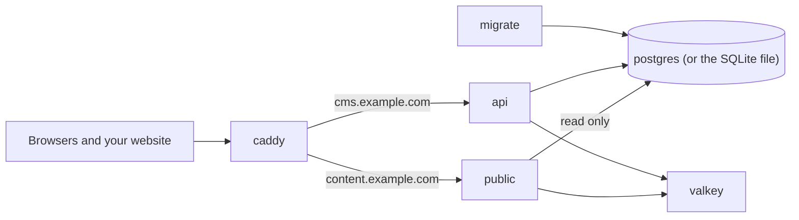

On your computer you learned Manablox with the `local` preset. To put your CMS on the internet you need a server that is always on, a domain name, and HTTPS. This page walks you through it from an empty server to your first sign-in.

You use the `docker` preset of `manablox create` for this. It writes a project in which everything runs in Docker containers: the database, the cache, the CMS, the public API for your website and a web server in front of them that gets HTTPS certificates on its own. You do not install Node.js, Postgres or anything else on the server except Docker.

## What runs on the server

A container is a small, isolated program with everything it needs packed inside. Docker Compose starts several of them together from one file, `compose.yml`. Your project starts these services:

| Service | What it does |
| --- | --- |
| `caddy` | The web server in front. It gets and renews HTTPS certificates and sends each request to the right service. It is the only service reachable from the internet. |
| `api` | The admin and the management API, in one process. |
| `public` | The public API your website reads content from. It can only read, and serves one space. |
| `migrate` | Brings the database tables up to date, then stops. It runs before `api` and `public` start. |
| `postgres` | The database. Everything you create in the admin lives here. Not there with SQLite, see below. |
| `valkey` | A fast cache and the queue for background jobs. |
| `site` | Shows the spaces you [designed in the admin](../design/index.md) as websites, on the domains you add there. Only there if you kept designed websites (the website plugin) when creating the project. It can only read. |

How a designed site goes live is explained in [Put the designed site online](../design/domains.md#put-the-designed-site-online).



Uploaded files are kept in a Docker volume called `uploads`. A volume is a folder Docker manages for you; it survives when containers are rebuilt or restarted.

If you chose SQLite as the database (`--database sqlite`), there is no `postgres` service. The database is the file `manablox.db` in a volume called `database`, which `migrate`, `api` and `public` all open. SQLite allows one writer, so never run more than one `api`. See [The database](../your-project/database.md).

:::note
If you chose `--proxy nginx` or `--proxy none`, the box in front is nginx or your own web server instead of Caddy. See [Domains and HTTPS](./domains-and-https.md).
:::

## Pick a server

A small virtual private server (VPS) from any hosting company is enough. Choose a current Linux, for example Ubuntu LTS or Debian.

How much memory? The compose file gives every service an upper memory limit:

| Service | Memory limit |
| --- | --- |
| `postgres` | 1 GB |
| `api` | 1 GB |
| `public` | 768 MB |
| `valkey` | 384 MB |

Together that is a little over 3 GB (about 2 GB with SQLite, which has no `postgres` service). A server with 4 GB of RAM gives every service its full room. The limits are ceilings, not reservations, so a small site also runs on 2 GB, but a busy one may get slow. Plan at least 20 GB of disk, plus room for your uploads and backups.

You need to reach the server with SSH, the tool for opening a terminal on another machine. Your hosting company shows you the address (for example `203.0.113.10`) and how to log in:

```sh
ssh root@203.0.113.10
```

## Install Docker on the server

Follow the official guide for your Linux at [docs.docker.com/engine/install](https://docs.docker.com/engine/install/). It installs Docker Engine together with the Compose plugin. When it is done, check both:

```sh
docker --version
docker compose version
```

Each command prints a version number. If `docker compose` says it is not a docker command, the Compose plugin is missing; install it as the Docker guide describes.

If you log in as a normal user instead of `root`, allow that user to run Docker, then log out and in again:

```sh
sudo usermod -aG docker $USER
```

## Point your domains at the server

Your CMS uses two addresses: one for the admin (for example `cms.example.com`) and one for the public API (for example `content.example.com`). At the company where you registered your domain, open the DNS settings and add an `A` record for each name with your server's IP address. If your server also has an IPv6 address, add an `AAAA` record too.

DNS changes can take a few minutes up to a few hours. You can check from your computer:

```sh
ping cms.example.com
```

The answer should show your server's IP address. Caddy can only get a certificate once both names point at the server, so do this before you start the stack.

## Create the project

The easiest way is to create the project on your own computer, where you already have Node.js and pnpm (see [What you need](../getting-started/before-you-begin.md)), and copy it to the server.

1. On your computer, run the create command with the docker preset:

```sh
pnpm dlx @manablox/cli create my-cms --preset docker
```

2. When it asks how the instance will run, choose `Docker behind Caddy`. With `--preset docker` it is already highlighted, so press Enter.
3. Enter your two domains (`cms.example.com` and `content.example.com`) and an email address for certificate notices. Let's Encrypt, the free certificate authority Caddy uses, writes to it before a certificate would expire.
4. Answer the questions about uploads and mail. You can change both later in `.env`.
5. Answer yes to installing dependencies, and no to building and starting the stack (you start it on the server, not on your computer).
6. Copy the folder to the server, for example into `/srv/my-cms`. `rsync` copies everything except the installed packages, which the server does not need:

```sh
rsync -av --exclude node_modules my-cms/ root@203.0.113.10:/srv/my-cms/
```

7. Log in to the server and go into the folder:

```sh
ssh root@203.0.113.10
cd /srv/my-cms
```

You can also keep the project in a private Git repository and pull it on the server. `.env` is deliberately left out of Git, so copy that one file to the server yourself (for example with `scp`).

If you prefer to create the project directly on the server, install Node.js and pnpm there and run the same command inside `/srv`.

The command options are all listed in [The manablox command](../help/cli.md).

## Make sure the lockfile exists

The file `pnpm-lock.yaml` records the exact version of every package. The image build refuses to run without it, so the server always installs exactly what you tested.

If `manablox create` installed the dependencies, the file is already there. Check:

```sh
ls pnpm-lock.yaml
```

If it says "No such file", write it with the script that came with your project. It runs pnpm inside a temporary Docker container, so it works on the server without Node.js:

```sh
./scripts/lockfile.sh
```

Run it again whenever you change `package.json`.

## Check the .env file

`.env` holds everything that differs between installations: domains, passwords and settings. Open it on the server, for example with `nano .env`. The secrets (`POSTGRES_PASSWORD`, `DATABASE_OWNER_PASSWORD`, `DATABASE_APP_PASSWORD`, `POSTGRES_PUBLIC_PASSWORD`, `AUTH_SECRET`; with SQLite only `AUTH_SECRET`) were generated for you; leave them as they are. Check these lines:

| Variable | What to check |
| --- | --- |
| `ADMIN_DOMAIN`, `PUBLIC_DOMAIN` | Your two domains, without `https://` |
| `PUBLIC_URL`, `PUBLIC_API_URL` | The same two domains with `https://` in front. They must match the domains above. |
| `ACME_EMAIL` | An address you read |
| `STORAGE_DRIVER` | `local` keeps uploads on the server; `s3` needs the `S3_*` lines filled in. See [Uploads and images](../your-project/storage-and-media.md). |
| `MAIL_DRIVER` | `none` by default, so the CMS sends no email. See [Sending email](../your-project/mail.md). |
| `MANABLOX_LICENSE_KEYS` | With the website or AI plugin: your license key. Your laptop ran them without one, but a server on a public domain is production: without a key they lock. The key activates as production and takes a seat. The server must be allowed to make outbound HTTPS calls to `licenses.manablox.io`. See [Premium plugins and licenses](../your-project/premium-plugins.md). |

Every variable is explained in [The .env file](../your-project/environment.md).

:::note
Compose hands every variable in `.env` to the CMS container. To change a setting later, for example to switch `MAIL_DRIVER` to another provider, edit `.env` and run `docker compose up -d`.
:::

## Build and start

First build the image. It downloads the Manablox packages and packs them with your project files. The first build takes a few minutes:

```sh
docker compose build
```

Then start everything in the background (`-d` means "detached", so you get your terminal back):

```sh
docker compose up -d
```

Compose starts `postgres` (not with SQLite) and `valkey`, runs `migrate` once, then starts `api`, `public` and `caddy`. Check the state of the services:

```sh
docker compose ps
```

After about half a minute `api` should show `Up` and `(healthy)`. `migrate` is not in the list because it finished its work. `public` shows `(unhealthy)` for now; that is expected until you create a space (see below).

To watch what the CMS is doing, follow its logs. Press Ctrl+C to stop watching; the services keep running:

```sh
docker compose logs -f api public
```

If `api` does not become healthy, look at `docker compose logs migrate` and `docker compose logs api`. If the site does not load in the browser, `docker compose logs caddy` usually says why, for example that a domain does not point at the server yet. More help is in [Common problems](../help/troubleshooting.md).

## Sign in for the first time

Open `https://cms.example.com` in your browser. You should see the admin's sign-up form, and the lock icon in the address bar shows that HTTPS works.

The first account you create becomes the superadmin, the account that may do everything. Sign-up closes after it.

:::danger
Your CMS is on the internet from the moment the stack is up. Create the superadmin account right away, so nobody else can claim it.
:::

Then create a space, as you did on your computer. [Sign in and create a space](../getting-started/first-sign-in.md) shows each step.

## Pin the public API to a space

The public API serves exactly one space. Until a space exists it runs, but answers every request with status 503 and the error `publicApi.space.unresolved`, and Docker shows it as unhealthy. As soon as there is exactly one space, it picks that one by itself within about ten seconds. Check it:

```sh
curl https://content.example.com/readyz
```

An answer that starts with `{"status":"ready"` means the public API serves a space. An error with `publicApi.space.unresolved` means it is still waiting for one.

If you have several spaces, it keeps answering 503 until you tell it which one to serve. Find the space's technical name in the admin (see [Spaces and members](../admin/spaces.md)), put it into `.env`:

```sh
MANABLOX_SPACE=blog
```

Then recreate the `public` service so it reads the new value:

```sh
docker compose up -d public
```

## What next

Your website reads content from `https://content.example.com`. When you create it with `manablox frontend`, pass `--url https://content.example.com` and `--editor-origin https://cms.example.com`; see [The starter website](../website/starter-website.md) and [The public API](../website/public-api.md). The website itself is a separate project and is not part of this compose file.

Before real content goes in, set up [Backups](./backups.md) and go through the [Security checklist](./security.md).
