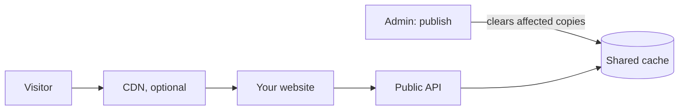

A cache is a stored copy of an answer, kept so the same question does not have to be worked out again. Caches make a website fast and keep the CMS calm when many people visit at once. The catch is that a copy can be out of date. This page explains every copy between a publish in the admin and a visitor's screen, and how long each can lag behind.

## The short version

- After you publish, the public API shows the new version right away. Manablox throws away the old copies the moment you publish.
- The starter website may keep its own copy for up to 30 seconds (Astro), so give it half a minute before you worry.
- A CDN in front of your website or public API may keep copies for up to 5 minutes (`PUBLIC_CACHE_TTL`), unless you clear it on publish.
- The admin and the visual editor never use a cache. Editors always see the current state.

## The layers



### 1. The public API's own cache

When the public API answers a REST request or a GraphQL query, it keeps the answer in the shared cache (Valkey, which your project starts with `pnpm services:up`). The next visitor who asks the same question gets the stored copy without a trip to the database. Every visitor gets the same answer, because the public API has no logins.

Each stored answer remembers which documents it used. When an editor publishes, unpublishes or deletes a document, Manablox immediately removes every stored answer that used it. Answers that could change because of any new document, such as lists without a type, menus, and the home page, are removed on every publish in the space. Saving a menu or changing the home page clears them too.

So why is there a time limit at all? `PUBLIC_CACHE_TTL` (300 seconds by default) is a safety net: even an answer nobody cleared is thrown away after that time.

Both REST and GraphQL send the caching headers described below. Answers with an error are not stored.

:::note
The clearing works because the admin and the public API share one Valkey (`REDIS_URL` in `.env`). A `local` project made by `manablox create` is set up like that. If `REDIS_URL` were missing, each process would keep its own copies in memory, and a publish in the admin could not clear the public API's copies; changes would then take up to `PUBLIC_CACHE_TTL` to appear.
:::

### 2. The client in your website

The SDK keeps answers in memory for a short time and merges identical requests that run at the same moment. By default that is one second. The starter websites set it to 30 seconds, mainly so the menu is fetched once even though the layout and the page both ask for it.

| Starter | How long it may show an old version after a publish |
| --- | --- |
| Astro | Up to 30 seconds (one client for the whole server) |
| Vite + Vue, Vite + React | No delay on the server (a new client for every page request) |
| Vite + TypeScript | Up to 30 seconds, but only in a browser tab that already had the page open |

Want it faster? Lower `ttl` in `src/lib/manablox.ts` (`cache: { ttl: 30_000 }` is in milliseconds), or pass `{ fresh: true }` to a single call. See [The SDK](./sdk.md#caching-in-the-client).

### 3. Browsers and CDNs

A CDN (content delivery network) is a service with servers around the world that keeps copies of your pages close to your visitors. You do not need one to start; many sites add one when they grow.

Every public API answer to a `GET` request carries this header:

```
Cache-Control: public, max-age=0, s-maxage=300, stale-while-revalidate=3000
```

In plain words:

- `max-age=0`: a browser must not reuse its copy without asking. It does ask cheaply, though: the answer has an `ETag` (a fingerprint), and if nothing changed the public API replies "not modified" (status 304) without sending the content again.
- `s-maxage=300`: a CDN may keep the answer for `PUBLIC_CACHE_TTL` seconds.
- `stale-while-revalidate=3000`: after that, a CDN may hand out the old copy for a while longer (ten times the TTL) while it fetches a fresh one in the background.

The server-rendered starter websites send the same kind of header on their HTML pages (`s-maxage=300`), and `no-store` on error pages, so a short CMS outage is never kept as a broken page.

An answer that contains an error is never cached anywhere.

### 4. Images

Resized images (`/media/...`) are cached forever by browsers and CDNs. That is safe because the address of an image contains a version: when an editor replaces or re-crops an image, it gets a new address, and the website asks for the new one.

## Putting a CDN in front

If you use a CDN, the public API's own clearing does not reach it: the CDN keeps its copy until `s-maxage` runs out. You have two choices:

- Accept the delay. With the default, a publish shows up within about 5 minutes. Lower `PUBLIC_CACHE_TTL` to shorten it, at the cost of more requests to your server.
- Clear the CDN on publish. Most CDNs have an API for that. Let a webhook that fires on Published tell a small script of yours to call it (see [Webhooks](../admin/webhooks.md)), or call it from a hook in your project (see [Hooks](../extending/hooks.md)).

A CDN only caches `GET` requests. REST uses `GET`; the SDK's GraphQL transport sends `POST`, which a CDN passes through. If you want a CDN to cache your content API, use the REST transport.

## Settings

In `.env` of your CMS project:

| Variable | Default | Meaning |
| --- | --- | --- |
| `PUBLIC_CACHE_TTL` | `300` | Seconds the public API keeps an answer, and the `s-maxage` it sends |
| `CACHE_ENABLED` | `true` | `false` turns the server-side cache off |
| `REDIS_URL` | set by `manablox create` | The shared Valkey both processes use |

Restart `pnpm dev:public` after a change. See [The .env file](../your-project/environment.md).

## If a publish does not show up

1. Check that the document is really published (not only saved), see [Drafts, publishing and versions](../content-model/publishing.md).
2. Open the REST address of the page, for example `http://localhost:3100/v1/permalink/about`. If the change is there, the public API is fine and the old copy sits in your website or a CDN.
3. Wait 30 seconds and reload your website, to rule out the starter's own client cache.
4. If you use a CDN, clear it or wait for `PUBLIC_CACHE_TTL`.
5. Still old? Check that `REDIS_URL` is the same for both processes.
