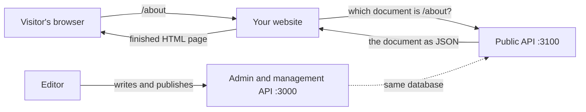

Manablox is a headless CMS: it stores and organises your content, but it does not draw your website. Your website is a separate program that asks Manablox for content over HTTP, the same way a browser asks for a web page, and then turns the answer into HTML. This section shows you how to build that website.

If the words space, document, block or permalink are new to you, read [Key ideas](../concepts.md) first.

:::tip
Do not want to build a website yourself? Manablox can also show your content as a finished site that you design in the admin, with no code. See [A website without code](../design/index.md).
:::

## The idea in one example

Say a visitor opens `https://example.com/about`. Your website receives that request and asks Manablox: "which published document has the permalink `about`?" Manablox answers with the document as data (JSON): its title, its fields and its blocks. Your website renders that data with its own templates and sends the finished page to the visitor.



Editors never touch the website code. They write and publish in the admin, and the website shows whatever is published the next time it asks.

## Two APIs: management and public

An API is a set of web addresses that programs (instead of people) call to read or change data. A Manablox project has two of them.

| | Management API | Public API |
| --- | --- | --- |
| Address in a `local` project | `http://localhost:3000` | `http://localhost:3100` |
| Started with | `pnpm dev` | `pnpm dev:public` |
| What it is for | The admin, scripts that change content, preview | Your website |
| What it can read | Drafts and published content, every space | Published content of one space |
| Needs a login or key | Yes, for anything private | Never |
| Can change content | Yes | No, it is read-only |

Your website should read from the **public API**. It can never show a draft by mistake, it needs no password or key that could leak into the browser, and it is built to handle many visitors. [The public API](./public-api.md) explains how to start it and how it picks its space.

The management API is where the admin lives. Websites only talk to it for special cases such as showing drafts on a staging server, see [Preview and the visual editor](./preview.md).

## Three ways to ask

The public API understands three styles of question. They return the same content; they differ in how you ask.

| Way | What it looks like | Good for |
| --- | --- | --- |
| [The SDK](./sdk.md) | A JavaScript library: `cms.byPermalink('/about')` | Any JavaScript or TypeScript website. The easiest start |
| [REST](./rest.md) | Plain web addresses: `GET /v1/permalink/about` | Quick tests with `curl` or the browser, non-JavaScript websites, scripts |
| [GraphQL](./graphql.md) | One address, `POST /graphql`, with a query that lists exactly the fields you want | Teams that already use GraphQL, pages that need only a few fields |

### Which one should you pick?

If you are new to this: **use the SDK, with its REST transport**. A transport is the way the SDK talks to the API behind the scenes. With REST, every document arrives complete, so you never have to list fields, and your code keeps working when an editor adds a field. The starter website works exactly like this.

You can always switch later. The SDK offers the same functions over GraphQL, and you can mix plain REST calls with SDK calls in one website.

## The fastest route to a working website

You do not have to write any of this by hand. One command writes a complete website that already reads from the public API, renders pages by their permalink, shows the main menu and supports the visual editor:

```sh
pnpm dlx @manablox/cli frontend my-site
```

[The starter website](./starter-website.md) walks through every question it asks. If you prefer Nuxt, follow [A Nuxt website](./nuxt.md) instead.

## What to read next

- [The starter website](./starter-website.md): create a website with one command.
- [The public API](./public-api.md): start it and point it at the right space.
- [The SDK](./sdk.md): the functions your website calls.
- [Preview and the visual editor](./preview.md): let editors see their changes on the real site before publishing.
- [Caching](./caching.md): why a publish shows up on the website within seconds, and what can delay it.
