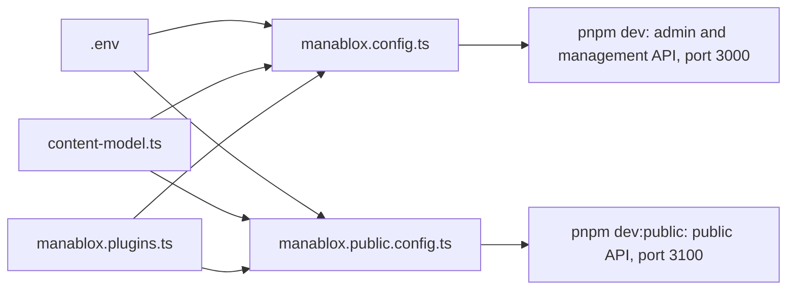

`manablox create` writes a small folder that holds your whole CMS. There is no hidden code in it: the CMS itself comes from npm packages, and your folder only says how to run them. This page walks through every file, so you know which ones matter and which ones you can leave alone.

Most of the time you will touch only three things: the `.env` file, `content-model.ts` and, now and then, `manablox.config.ts`.

## The files of a local project

A project made with the `local` preset (Docker runs only the database and the cache, the CMS runs on your computer) with Postgres looks like this:

```
my-cms/
  .env
  .env.example
  .gitignore
  README.md
  compose.yml
  content-model.ts
  manablox.config.ts
  manablox.plugins.ts
  manablox.public.config.ts
  manablox.site.config.ts
  package.json
  pnpm-lock.yaml
  pnpm-workspace.yaml
  postgres/init/10-roles.sh
  postgres/init/20-public-role.sh
  tsconfig.json
  node_modules/
  data/
```

`manablox.public.config.ts` is only there if you answered yes to the public API question (the default), and `manablox.site.config.ts` only with designed websites. `pnpm-lock.yaml` and `node_modules/` appear once `pnpm install` has run. `data/` appears the first time someone uploads a file.

With SQLite as the database (see [The database](./database.md)) there is no `postgres/init/` folder, and `data/` appears with the first `pnpm migrate`, because the database itself is the file `data/manablox.db`.

| File | What it is for | Will you edit it? |
| --- | --- | --- |
| `.env` | Passwords, secrets, ports and switches for this one installation. See [The .env file](./environment.md) | Yes, whenever a setting changes |
| `.env.example` | The same file with the secrets left blank. Safe to share and to commit to Git | Only if you add new variables and want others to know about them |
| `.gitignore` | Tells Git to leave out `node_modules/`, `data/`, `.env` and log files | Rarely |
| `README.md` | A short summary of the project and its commands, written for your preset | No, but read it once |
| `compose.yml` | Tells Docker which helper services to run: Postgres (the database, not with SQLite), Valkey (the cache and job queue) and, if you chose it, Mailpit (a test inbox) | Rarely, for example to add Mailpit later |
| `content-model.ts` | Your content types written as code, plus the plugins. Starts empty. See [Content types in code](./content-types-in-code.md) | Yes, if you define content types in code |
| `manablox.config.ts` | The settings of the CMS process: database, login, uploads, images, mail, logs | Sometimes, for example for [image presets](./storage-and-media.md#image-presets) or [workflows in code](./resources-in-code.md) |
| `manablox.plugins.ts` | The features you picked (website, AI, workflows, webhooks), as plugins, for each process. `manablox plugin install` and `uninstall` add and remove them here, between marker comments | Rarely; keep your own edits outside the markers |
| `manablox.public.config.ts` | The settings of the public API process your website reads from | Rarely |
| `manablox.site.config.ts` | The settings of the site process that shows [designed sites](../design/index.md). Not there if you left designed websites out | Rarely, for example to switch [forms](../design/forms.md#switch-forms-on) on |
| `package.json` | The npm packages the project uses and the short commands (`pnpm dev` and friends). See [Everyday commands](./everyday-commands.md) | Only when you update Manablox or add a plugin |
| `pnpm-lock.yaml` | The exact package versions that were installed, so every computer gets the same ones | Never by hand; pnpm updates it |
| `pnpm-workspace.yaml` | A list of packages that pnpm may run install scripts for (image processing, password hashing and a few more). Without it `pnpm install` would skip them | No |
| `tsconfig.json` | Settings for TypeScript, the language the config files are written in. Used by `pnpm typecheck` | No |
| `postgres/init/10-roles.sh` | Runs once, the very first time the database starts, and creates the two database users of the CMS: `manablox_owner`, which owns the tables and runs `pnpm migrate`, and `manablox_app`, which the CMS connects as. Only with Postgres | No |
| `postgres/init/20-public-role.sh` | Runs once as well, and creates `manablox_public`, a read-only database user for the public API and the site process. Only with Postgres | No |
| `node_modules/` | The installed packages | Never; delete it and run `pnpm install` if it gets broken |
| `data/` | Uploaded files and rendered images, and with SQLite the database file. See below | Never by hand |

## The extra files of a docker project

A project made with the `docker` preset runs everything in containers, which is what you want on a server. It has the same files as above (without `data/`), plus:

| File | What it is for | Will you edit it? |
| --- | --- | --- |
| `Dockerfile` | Builds one image that runs every CMS process. It copies the whole project folder into the image, so plugins in subfolders come along | No |
| `.dockerignore` | Keeps `node_modules/`, `data/`, `backups/`, `.env`, `.git` and other local files out of the image | Only if you add a folder that must not go into the image |
| `compose.yml` | Here it describes the whole stack: database (with SQLite a volume instead of a service), cache, a one-time migration step, the CMS, the public API and a web server in front | Rarely. The CMS already receives every variable in `.env` |
| `caddy/Caddyfile` | The Caddy web server: HTTPS certificates and which domain goes where. Only with the Caddy proxy | Rarely |
| `nginx/templates/default.conf.template` | The same job for nginx. Only with the nginx proxy | Rarely |
| `nginx/certs/` and `scripts/selfsigned-certs.sh` | Where your HTTPS certificate goes, and a script that makes a test certificate. Only with nginx and HTTPS | You put your certificate files there |
| `scripts/lockfile.sh` | Writes `pnpm-lock.yaml` using Docker, so you do not need Node on the server | Never; run it after changing `package.json` |
| `scripts/backup.sh` | Saves the database and the uploads into `backups/` | No; see [Backups](../going-live/backups.md) |
| `scripts/restore.sh` | Brings a backup back | No |

In a docker project uploads live in a Docker volume instead of the `data/` folder, and backups land in a `backups/` folder next to `compose.yml`. [Put it on a server](../going-live/index.md) walks through that setup.

## How the three .ts files fit together

Your project has up to two CMS processes, and each one reads its own config file:

- `manablox.config.ts` is the management instance: the admin in your browser and the API it talks to. `pnpm dev` starts it.
- `manablox.public.config.ts` is the public API: a separate, read-only process that only serves published content to your website. `pnpm dev:public` starts it. See [Management API and public API](../concepts.md#management-api-and-public-api).

Both files import `content-model.ts` and `manablox.plugins.ts`. That way the admin and the public API always know exactly the same content types and plugins, and you define them in one place only. `manablox.plugins.ts` lists the feature plugins per process: `plugins` for the management instance, `publicPlugins` for the public API, which loads only the plugins that serve public requests. Both config files also read the same `.env` file.

With designed websites, a third file, `manablox.site.config.ts`, runs the site process (`pnpm dev:site`). All three load the website plugin, `websitePlugin()` from `@manablox/plugin-website`: the CMS for the Design section, the public API to deliver block designs, the site process to show the sites. The AI plugin, `aiPlugin()` from `@manablox/plugin-ai`, is loaded only by the management instance, since only the admin uses it, and so are the workflows plugin and the webhooks plugin, `workflowsPlugin()` and `webhooksPlugin()`. The website and AI plugins bring the license plugin, `licensePlugin()` from `@manablox/plugin-license`, which checks their license keys (see [Premium plugins and licenses](./premium-plugins.md)).



A good rule for where a setting belongs:

- Anything that differs between your computer and the server (passwords, addresses, ports, which mail service) goes into `.env`. The config files read it from there.
- Anything that is part of your product and the same everywhere (content types, image presets, workflows in code, plugins) goes into the `.ts` files.

That way the same files run on your laptop and on the server, and only `.env` changes.

:::caution
Never commit `.env` to Git or send it to anyone. It holds the database password (with Postgres) and the secret that signs every login. `.gitignore` already leaves it out; share `.env.example` instead.
:::

## The data folder

In a local project the CMS keeps files in `data/`:

| Folder | What is in it |
| --- | --- |
| `data/uploads/` | Every file uploaded in the admin, and the resized images the CMS made from them |
| `data/media-cache-public/` | Resized images made by the public API, which may not write into the uploads folder |
| `data/media-cache/` | A cache folder for the CMS process. It usually stays empty, because the CMS keeps its resized images in `data/uploads/` |
| `data/manablox.db` | Only with SQLite: the database, with `manablox.db-wal` and `manablox.db-shm` beside it while the CMS runs |

The folders are created on first use. The two cache folders can be deleted at any time; missing images are simply made again on the next request. `data/uploads/` is real content: back it up together with the database. Where these folders are is set in `.env`, see [Uploads and images](./storage-and-media.md).

With Postgres, your content itself (pages, users, settings) is not in this folder. It lives in the Postgres database, which Docker keeps in a volume. With SQLite it is the file `data/manablox.db`. [The database](./database.md) explains both, [Everyday commands](./everyday-commands.md#starting-fresh) how to wipe it, and [Backups](../going-live/backups.md) how to keep it safe.
